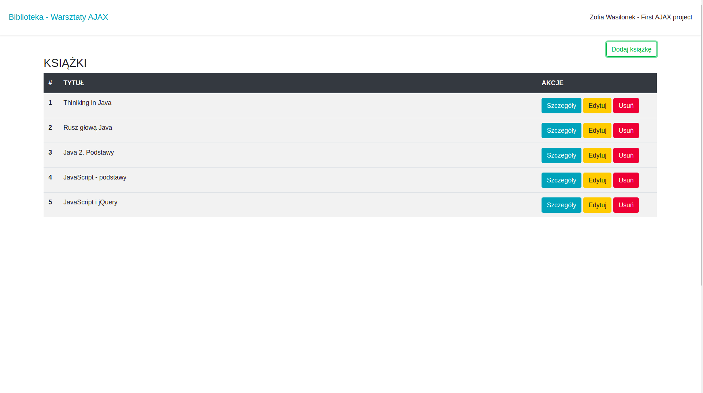

# Library-AJAX

Moja pierwsza aplikacja z użyciem technologii AJAX. 
Jest to archiwum książek, w którym można wykonywać podstawowe akcje CRUD. 
Aplikacja składa się z dwóch części: 
 * napisanej w języku Java, REST API z wystawionymi endpointami na statycznej ścieżce "http://localhost:8282", którą należy uruchomić na lokalnym IDE.
 * napisanej w języku JavaScript z użyciem AJAX aplikacji archiwizującej książki, które można dodawać, edytować, podglądać szczegóły wybranej książki oraz usuwać.
 

## Technologie
 * Java
 * JavaScript
 * AJAX
 * Bootstrap

## Jak uruchomić aplikację
* Aby uruchomić REST API należy na swoim lokalnym IDE uruchomić klasę Main.java, która znajduje się w katalogu /src/main/java/pl/codeschool/rest 
    Po uruchomieniu możemy przetestować działanie drugiej części aplikacji pod "http://localhost:8282".  
    Mamy dostępne endopinty "http://localhost:8282/books" + "/all", "/find/{id}", "/add", "/delete/{id}" lub "/update/{id}".

* Aby uruchomić część wizualną aplikacji należy otworzyć w przeglądarce index.html, który znajduje się w katalogu src/main/webapp lub uruchomić aplikację na lokalnym serverze (np.Tomcat) 

## Kontakt 
zofiawasilonek@.gmail.com 
<a href="https://www.linkedin.com/in/zofia-wasilonek/">Linkedin</a>

